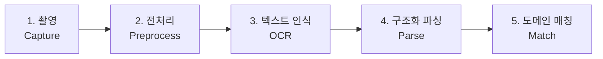
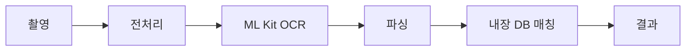
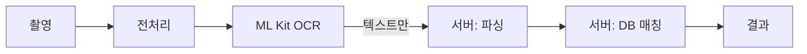
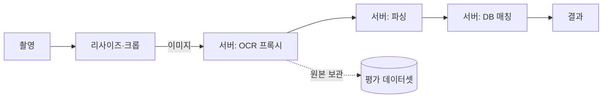
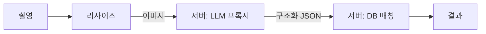
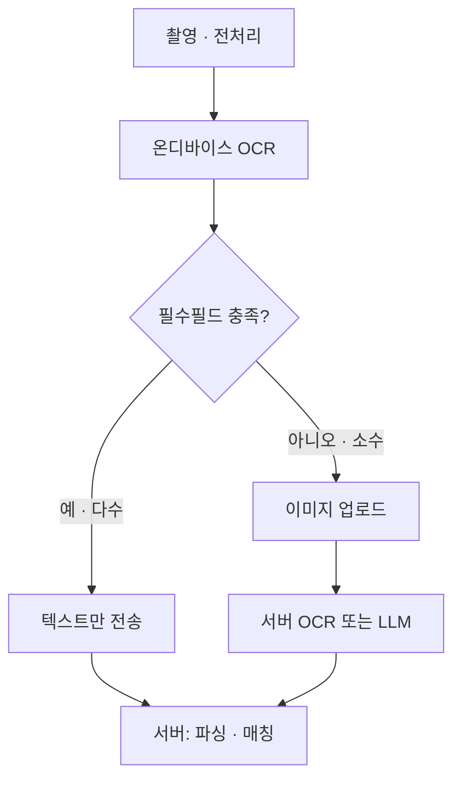
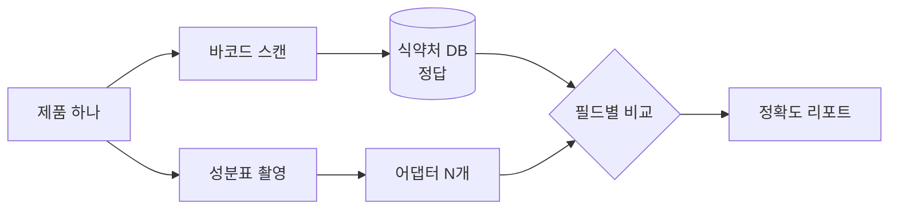

# OCR 처리 방식 경우의 수

2026-09-22 · @Jerry

사진에서 텍스트를 추출해 가공식품을 분석하는 앱에서, OCR 처리를 어디에 어떻게 배치할 수 있는지 가능한 구조를 전부 나열하고 비교한다.

## 결정 기준: 여섯 개의 축

OCR 방식 비교는 대개 정확도 하나로 수렴하지만, 실제로 프로젝트를 좌우하는 축은 여섯 개다. 정확도는 그중 하나일 뿐이고, **실측 전에는 어느 방식이 나은지 알 수 없다**는 점이 오히려 결정적이다.

| 축 | 질문 | 왜 중요한가 |
| --- | --- | --- |
| 정확도 | 한글 성분표의 숫자·단위를 얼마나 정확히 읽는가 | 목표지만 사전 예측 불가. 측정해야만 알 수 있다 |
| 호출 비용 | 스캔 1건당 얼마인가 | 방식 간 차이가 0원에서 수십 원까지, 수백 배 벌어진다 |
| 지연 | 촬영 후 결과까지 몇 초인가 | 3초를 넘기면 체감상 느린 앱이 된다 |
| 프라이버시 | 무엇이 기기를 떠나는가 | 성분표 사진에는 주변 환경과 사람이 함께 찍힌다 |
| 오프라인 | 네트워크 없이 동작하는가 | 마트 지하 매장에서 신호가 끊기는 것이 실제 사용 맥락이다 |
| 디버깅 가능성 | 틀렸을 때 원인을 추적할 수 있는가 | 가장 과소평가되는 축. 아래 참조 |

### 디버깅 가능성을 따로 세우는 이유

OCR은 확률적으로 실패한다. `나트륨 1,200mg`을 `1.200mg`으로 읽는 종류의 오류는 반드시 나오고, 진짜 문제는 **그 실패를 사후에 재현할 수 있느냐**다.

원본 이미지가 어디에도 남지 않는 구조에서는 사용자가 결과가 이상하다고 신고해도 무엇이 잘못됐는지 확인할 방법이 없다. 추출된 텍스트만으로 원본을 역추적할 수는 없다. 이 제약은 방식을 고른 뒤에 되돌리기 어렵고, 프라이버시 축과 정면으로 충돌한다.

이 문서는 여섯 축을 모두 적용하되, 이 프로젝트가 **OCR 학습을 목적**으로 한다는 점을 반영해 디버깅 가능성과 측정 가능성에 상대적으로 큰 가중치를 둔다. 상업 프로젝트로 넘어갈 때는 비용과 프라이버시의 가중치가 올라간다.

## 파이프라인 5단계: 경우의 수는 '선을 어디서 끊느냐'다

사진 한 장이 분석 결과가 되기까지 다섯 단계를 거친다. 이 단계들은 방식을 어느 것으로 고르든 동일하게 존재한다. 달라지는 건 단계의 유무가 아니라 **어느 단계 사이에서 네트워크를 건너느냐** 하나뿐이다.



왼쪽은 반드시 기기에서(촬영), 오른쪽은 보통 서버에서(DB 매칭) 일어난다. 경우의 수란 그 사이 네 개의 경계 중 어느 지점에 가위를 대느냐다.

| 단계 | 하는 일 | 입력 → 출력 |
| --- | --- | --- |
| 1. 촬영 | 카메라 프리뷰, 초점, 성분표 영역 유도 | — → 원본 이미지 |
| 2. 전처리 | 리사이즈, 회전·기울기 보정, 대비·이진화, 크롭 | 이미지 → 정제된 이미지 |
| 3. 텍스트 인식 | 픽셀을 글자로. 좌표·신뢰도 포함 | 이미지 → 텍스트 블록들 |
| 4. 구조화 파싱 | "나트륨 1,200mg" → `{sodium_mg: 1200}` | 텍스트 → 구조체 |
| 5. 도메인 매칭 | 성분명 정규화, 기준치 환산, 제품 식별 | 구조체 → 분석 결과 |

### 두 가지 고정점

**1단계는 항상 기기에서** 일어난다. 선택지가 없다.

**5단계는 사실상 항상 서버에서** 일어난다. 식약처 공공 데이터를 캐싱한 DB가 서버에 있기 때문이다. 예외는 방식 A(완전 온디바이스) 하나뿐이고, 그것도 DB를 앱에 내장한다는 상당한 대가를 치릅니다.

따라서 실질적인 선택지는 **2–4단계를 어디에 배치하느냐**로 좁혀진다. 이후 여섯 가지 방식은 전부 이 질문에 대한 서로 다른 답이다.

## 방식 A — 완전 온디바이스

다섯 단계를 모두 기기에서 처리하고 네트워크를 전혀 쓰지 않는다. 성분 DB까지 앱에 내장해야 한다.



### 장점

- **비용이 정확히 0원.** 사용자가 몇 명이든, 몇 번을 스캔하든 동일하다
- **지연이 가장 짧다.** 네트워크 왕복이 없어 수백 ms 수준이 가능하고, 실시간 프리뷰 오버레이도 현실적이다
- **프라이버시가 구조적으로 보장된다.** 이미지도 텍스트도 기기를 떠나지 않으므로 정책이 아니라 설계가 보장한다
- **완전 오프라인.** 마트 지하 매장에서도 동일하게 동작한다

### 단점

- **파서를 고치려면 앱을 재배포해야 한다.** 원재료 파서는 실제 데이터를 보면서 수십 번 고치게 되는데, 그때마다 심사 없는 배포라도 사용자 업데이트를 기다려야 한다
- **성분 DB를 기기에 넣어야 한다.** 가공식품 마스터는 수십만 건 규모라 전수 내장은 비현실적이고, 부분 내장하면 커버리지가 깨진다
- **신제품이 반영되지 않는다.** 데이터 갱신이 앱 버전에 묶인다
- **디버깅이 가장 어렵다.** 서버가 아무것도 보지 못하므로 정확도를 집계할 방법조차 없다
- **개발 빌드 필수.** ML Kit 계열은 네이티브 모듈이라 Expo Go에서 동작하지 않고, 앱 용량도 늘어난다
- **기기 성능에 정확도가 좌우된다.** 구형 안드로이드에서의 품질을 별도로 검증해야 한다

### 적합한 상황

프라이버시가 제품의 핵심 약속이거나, 오프라인 동작이 필수 요구사항이거나, 호출량이 과금을 감당할 수 없을 만큼 많은 경우.

### 이 프로젝트에서의 현실성

**최종 형태로는 매력적이지만 시작점으로는 부적합하다.** 성분 DB 내장 문제가 결정적이다. 식약처 데이터를 캐시해 쓰기로 이미 결정했고, 그 DB는 서버에 산다. 더 근본적으로는 디버깅 불가 항목이 치명적인데, **OCR 학습이 목표인 프로젝트에서 정확도를 측정할 수 없다면 배울 것이 없다.**

단, 2–3단계만 온디바이스로 떼어내면 방식 B가 된다. 그쪽이 현실적인 타협점이다.

## 방식 B — 온디바이스 OCR → 텍스트만 서버 전송

기기에서 이미지를 텍스트로 바꿔 **텍스트만** 올리고, 파싱부터는 서버가 맡는다. 상용 앱의 가장 흔한 기본값이다.



### 장점

- **이미지가 기기를 떠나지 않는다.** 프라이버시와 대역폭을 동시에 얻는다. 사진 수백 KB 대신 텍스트 수 KB만 오간다
- **파서를 서버에서 고칠 수 있다.** 방식 A의 가장 큰 불편이 해소된다. 원재료 파서는 수십 번 고쳐야 하므로 이게 큼
- **성분 DB가 서버에 있어 항상 최신이다**
- **OCR 호출 비용이 0원**이고 지연도 짧다. 서버 왕복 한 번만 추가된다

### 단점

- **서버가 원본 이미지를 볼 수 없어 디버깅이 막힌다.** 아래 별도 설명
- **개발 빌드 필수.** ML Kit가 네이티브 모듈이므로 Expo Go에서 못 돌린다
- **기기별로 정확도가 달라진다.** OCR 품질이 사용자의 하드웨어에 종속되며, 서버는 그걸 보정할 수 없다
- **OCR 엔진 교체가 앱 배포를 요구한다.** 더 나은 엔진이 나와도 즉시 적용할 수 없다
- **키가 아닌 텍스트가 오면 복구 불가.** OCR이 숫자를 틀리면 서버는 그걸 사실로 받아들일 수밖에 없다

### 함정: 디버깅 불가는 생각보다 비싸다

이 방식의 가장 큰 비용은 운영 단계에서 드러난다. 사용자가 "나트륨이 이상하게 나왔다"고 신고했을 때 서버 로그에 남은 건 이미 손상된 텍스트뿐이다. 원인이 조명인지, 사용자가 비스듬하게 찍은 것인지, 폰트가 특이한 것인지, 기기가 구형인지 구분할 수 없다.

더 심각한 건 **집계 자체가 안 된다**는 점이다. 정확도를 재려면 정답과 비교해야 하는데, 원본이 없으면 새 OCR 엔진을 과거 데이터에 돌려보는 것도 불가능하다. 엔진을 바꾸려면 처음부터 다시 데이터를 모아야 한다.

보완책으로 **사용자가 동의한 경우에만 실패 사례의 이미지를 업로드**하는 옵인 경로를 두는 방법이 있다. 프라이버시를 지키면서 데이터셋을 모으는 현실적인 절충안이다.

### 적합한 상황

제품이 안정화된 뒤의 기본값. OCR 정확도가 이미 검증되었고, 비용과 프라이버시를 동시에 최적화해야 하는 단계.

### 이 프로젝트에서의 현실성

**도착지로는 유력하고, 출발점으로는 이르다.** 정확도를 아직 모르는 상태에서 측정을 포기하는 구조를 먼저 고르는 것은 순서가 바뀌었다. 먼저 방식 C로 측정하고, 숫자가 나오면 여기로 옮긴다.

## 방식 C — 이미지 업로드 → 서버가 OCR

기기는 촬영과 경량 전처리만 하고 이미지를 올린다. 서버가 OCR 엔진(Cloud Vision 등)을 호출하고 나머지를 처리한다.



### 장점

- **네이티브 모듈이 필요 없다.** 사진을 찍어 HTTP로 보내는 게 전부라 Expo Go에서 그대로 돌아간다
- **OCR 엔진 교체가 서버 배포만으로 끝난다.** 앱을 다시 배포하지 않고 A/B 비교를 돌릴 수 있다
- **원본이 남아 재처리가 가능하다.** 방식 B가 포기한 것을 정확히 되돌려받는다. 새 엔진을 **과거 데이터 전체에 소급 적용**해 비교할 수 있다
- **기기 성능과 무관하게 품질이 균일하다**
- **스캔할수록 평가 데이터셋이 쌓인다.** 학습 목적에서는 이게 부산물이 아니라 본주에 가깝다

### 단점

- **호출당 비용이 발생한다.** 클라우드 OCR API는 보통 1,000건 단위로 과금되며, 무료 티어를 넘기면 사용량에 비례해 증가한다
- **지연이 길다.** 이미지 업로드 + OCR + 파싱이 직렬로 누적되며, 모바일 회선에서는 업로드가 지배적이다
- **이미지가 서버에 남는다.** 성분표 사진에는 매장·사람·손이 함께 찍힌다. 보관 기간과 삭제 정책을 명시해야 한다
- **오프라인 불가**
- **저장 비용이 누적된다.** 무제한 보관은 현실적이지 않으니 보관 기간을 정해야 한다

### 전처리를 기기에 남기는 이유

이 방식에서도 **리사이즈와 크롭은 기기에서** 해야 한다. 12MP 원본을 그대로 올리면 수 MB가 되지만, 성분표 영역만 크롭해 장변 1,600px로 줄이면 수백 KB로 떨어진다. 업로드 시간이 줄고 OCR 정확도는 오히려 올라간다. `expo-image-manipulator`로 처리한다.

다만 **평가용으로는 원본도 함께 보관**해야 한다. 전처리 파라미터 자체를 튜닝하려면 원본이 필요하기 때문이다.

### 적합한 상황

엔진을 아직 정하지 못했거나, 정확도를 측정해야 하거나, 빠르게 실험해야 하는 초기 단계.

### 이 프로젝트에서의 현실성

**M2 시작 시점에 가장 적합하다.** 세 가지가 동시에 맞아떨어진다 — 개발 빌드 없이 시작할 수 있고, 엔진을 갈아끼우며 비교할 수 있고, 스캔할때마다 평가 데이터셋이 쌓인다.

비용과 지연은 이 단계에서 감수할 만하다. 사용자가 본인 한 명이기 때문이다.

## 방식 D — 멀티모달 LLM이 OCR과 구조화를 동시에

이미지를 LLM에 그대로 넘기고 구조화된 JSON을 받는다. **3단계와 4단계가 합쳐져 사라진다.**



### 장점

- **파서를 안 써도 된다.** 중첩 괄호 원재료 문자열처럼 구현 난이도가 높은 부분을 건너뛴다
- **레이아웃에 강하다.** 표 형태가 깨졌거나 2단 조합이거나 곱선이 없는 성분표도 문맥으로 처리한다
- **오탈자 복구가 된다.** `정제수`를 `정제수`로 읽는 수준의 교정을 문맥으로 해낸다
- **구현이 가장 빠르다.** 프롬프트와 스키마만 정의하면 동작하는 것까지 가장 짧다

### 단점

- **호출당 비용이 가장 높다.** 이미지 토큰이 포함되어 전용 OCR API보다 비싸다
- **지연이 가장 길다.** 모델과 출력 길이에 따라 수 초 단위가 된다
- **비결정론적이다.** 같은 이미지가 호출마다 다른 결과를 낼 수 있어 회귀 테스트가 어렵다
- **환각 위험. 이 도메인에서는 치명적이다** — 아래 별도 설명

### 환각이 영양성분에서 치명적인 이유

일반 OCR의 실패는 **깨진 텍스트**로 나타난다. `나트륨 1,2O0mg` 같은 출력은 눈에 띄고, 검증 로직으로 걸러낼 수 있다.

LLM의 실패는 **그럴듯한 숫자**로 나타난다. 사진이 흔들려 나트륨 칸이 안 보이면, 이 유형의 제품이 보통 갖는 값을 채워 넣을 수 있다. 출력은 완벽하게 유효한 JSON이고, 검증 로직은 통과하며, **틀렸다는 신호가 어디에도 없다.**

알레르기 정보에서는 이게 안전 문제로 직결된다. 원재료 목록을 재구성하는 과정에서 눈에 잘 안 띄는 항목이 누락되면, 앱은 "대두 없음"이라고 말하게 된다. **오탐보다 미탐이 위험하다.**

### 완화 방법

그래서 이 방식은 단독으로 쓰면 안 되고, 쓴다면 제약을 걸어야 한다.

1. **근거 구간을 같이 반환받기** — 각 값이 이미지의 어느 위치에서 왔는지 함께 요구하면 지어내기가 줄어든다
2. **불확실은 `null`로** — 추정하지 말고 비워두도록 명시하고, 비어 있으면 사용자에게 확인을 받는다
3. **교차 검증** — 바코드로 조회한 정답이 있으면 대조한다. 이 프로젝트는 그게 가능하다
4. **산술 검증** — 탄수화물·단백질·지방으로 계산한 열량이 표기 열량과 맞는지 확인한다. 물리적 제약은 환각을 잡는 가장 싼 그물이다

### 적합한 상황

다른 방식이 실패한 케이스의 폴백, 또는 정형화되지 않은 라벨. 숫자 정확도가 결정적인 주경로에는 부적합하다.

### 이 프로젝트에서의 현실성

**비교 대상으로는 반드시 포함하되, 기본값으로 두지 말 것.** 특히 **원재료 문자열에서는 강력한 후보**다. 중첩 괄호 파서를 직접 짜는 것과 정면으로 비교해볼 만하다. 반대로 영양성분 숫자는 산술 검증을 걸어도 전용 OCR보다 안전하다고 볼 근거가 없다.

평가 하네스가 있으면 이 판단을 감이 아니라 숫자로 할 수 있다.

## 방식 E — 하이브리드 (신뢰도 기반 에스컬레이션)

온디바이스로 먼저 시도하고, 결과가 믿을 만하지 않을 때만 이미지를 서버로 올린다.



### 에스컬레이션 판단 기준

"신뢰도가 낮을 때"는 모호하다. 실제로는 세 가지 신호를 조합한다.

| 신호 | 판단 | 비고 |
| --- | --- | --- |
| OCR 신뢰도 점수 | 블록 평균이 임계치 미만 | 엔진별로 척도가 달라 보정이 필요하다 |
| 필수 필드 누락 | 열량·나트륨·당류 중 하나라도 미추출 | **가장 실용적.** 이진 판단이라 튜닝이 거의 필요 없다 |
| 산술 불일치 | 탄·단·지로 계산한 열량과 표기 열량이 불일치 | 오인식을 값싸게 잡는다 |

### 장점

- **비용과 지연을 대부분 0으로 유지**하면서 어려운 케이스에서만 정확도를 산다
- 에스컬레이션된 사례만 모으면 **어려운 케이스만 담긴 데이터셋**이 생긴다
- 사용자 입장에서는 대부분의 스캔이 즉각 끝난다

### 단점

- **구현해야 할 경로가 두 배다.** 둘 다 유지보수해야 하고 테스트도 두 배다
- **임계치를 정하려면 정확도 데이터가 이미 있어야 한다.** 닭곳이 먼저다
- 개발 빌드 필수이며, 온디바이스와 서버 출력 형식을 맞추는 정규화 계층이 추가로 필요하다

### 이 프로젝트에서의 현실성

**올바른 최종 형태이지만, 처음부터 이걸 만들면 안 된다.** 임계치를 정하려면 방식 A·B·C의 실측 정확도가 먼저 있어야 하기 때문이다. 데이터 없이 정한 임계치는 추측이고, 틀리면 비용과 정확도를 동시에 잃는다.

단, **필수 필드 누락**과 **산술 불일치**는 임계치 튜닝이 필요 없는 이진 조건이라 일찍 넣어도 된다. 신뢰도 점수 기반 판단만 나중으로 미룬다.

## 방식 F — 클라이언트가 클라우드 API 직접 호출 (안티패턴)

앱이 Cloud Vision이나 LLM API를 서버 없이 직접 호출하는 구조다. 튜토리얼에 흔하게 나오고 구현도 가장 간단해서 처음에 손이 가지만, **프로덕션에서는 예외 없이 배제해야 한다.**

### 왜 막아야 하는가

API 키를 앱에 넣는 순간 그 키는 공개된 것으로 봐야 한다. 환경변수나 난독화는 방어가 되지 않는다.

- **번들에서 추출된다.** `.ipa`·`.apk`는 누구나 받아 풀어볼 수 있다. JS 번들 문자열 검색으로 충분하다
- **통신에서 추출된다.** 프록시 도구로 HTTPS 헤더를 보면 그대로 드러난다
- **Expo 공개 환경변수는 비밀이 아니다.** `EXPO_PUBLIC_` 접두사가 붙은 값은 정의상 번들에 박힌다
- **OTA 업데이트도 마찬가지다.** `eas update`로 내려보내는 번들에도 그대로 들어있다

유출된 키는 타인이 사용하고 **과금은 소유자에게 청구된다.** 키를 폐기하면 이미 배포된 모든 앱이 즉시 멈추고, 심사를 거치는 앱이라면 복구에 며칠이 걸린다.

### 예외처럼 보이는 경우

일부 서비스는 호출자 제한(번들 ID, 리퍼러) 기능을 제공해 클라이언트 직호출을 허용한다. 그런 경우에도 **사용량 상한과 비정상 호출 탐지를 반드시 함께 걸어야** 하며, OCR·LLM API 대부분은 애초에 이 방식을 지원하지 않는다.

### 올바른 형태

어느 방식을 고르든 외부 API 호출은 **Supabase Edge Function을 앞에 둔다.** 키는 서버에만 있고, 앱은 자신의 사용자 토큰으로 Edge Function을 부른다. 이러면 사용자별 호출 제한, 비용 집계, 엔진 교체가 모두 서버에서 해결된다. 이미 Supabase를 쓰기로 했으므로 추가 인프라도 필요 없다.

## 비교 매트릭스

방식 F는 배제되었으므로 다섯 개를 비교한다. 정확도 열은 일부러 비워두었다 — **지금 채우면 추측이고, 그 추측이 결정을 오염시킨다.** 이 칸을 숫자로 메우는 것이 M2의 목표다.

|  | A 온디바이스 | B 텍스트만 전송 | C 이미지 → 서버 | D 멀티모달 LLM | E 하이브리드 |
| --- | --- | --- | --- | --- | --- |
| 호출 비용 | 없음 | 없음 | 중 | 높음 | 낮음 |
| 지연 | 최소 | 짧음 | 중 | 김음 | 대체로 짧음 |
| 오프라인 | 가능 | 불가 | 불가 | 불가 | 부분 |
| 프라이버시 | 최상 | 높음 | 낮음 | 낮음 | 높음 |
| 디버깅·측정 | 불가 | 어려움 | **최상** | 최상 | 부분 |
| 개발 빌드 | 필수 | 필수 | **불필요** | **불필요** | 필수 |
| 구현 난이도 | 높음 | 중 | 낮음 | **최저** | 최고 |
| 엔진 교체 | 앱 배포 | 앱 배포 | **서버만** | **서버만** | 둘 다 |
| 정확도 | 측정 필요 | 측정 필요 | 측정 필요 | 측정 필요 | 측정 필요 |

### 매트릭스가 말해주는 것

세로로 읽으면 도미노가 없지만, 가로로 읽으면 패턴이 보인다.

**디버깅·측정 행과 개발 빌드 행이 같은 방향을 가리킨다.** C와 D만이 둘 다에서 유리하다. 둘 다 이미지를 서버로 보내기 때문이다 — 비용과 프라이버시를 내주고 관측 가능성을 사는 거래다.

반대로 **비용·지연·프라이버시 행은 A·B·E를 가리킨다.** 온디바이스 계열이다.

두 그룹은 경쟁 관계가 아니라 **순서 관계**다. C로 측정해서 정확도 행을 채우고, 그 숫자를 근거로 B나 E로 옮기는 경로가 성립한다. 반대 순서는 성립하지 않는다 — B로 먼저 가면 정확도 행을 영원히 못 채운다.

## 교차 관심사: 어느 방식을 골라도 걸리는 것들

### 전처리가 정확도 기여 1위다

엔진 선택보다 전처리가 정확도를 더 크게 움직이는 경우가 많다. 같은 엔진이어도 입력 이미지가 달라지면 결과가 크게 바뀐다. 그런데 엔진 비교에만 신경 쓰고 전처리를 고정해두는 실수가 흔하다.

최소한 다음은 손대야 한다.

1. **크롭** — 성분표 영역만 잘라낸다. 배경 텍스트(제품명, 홍보문구)를 제거하는 효과가 가장 크다
2. **리사이즈** — 장변 1,600px 안팎. 더 크면 업로드만 느려지고 정확도는 거의 안 오른다
3. **회전·기울기 보정** — 성분표는 병·봉지 곡면에 있어 흔히 기울어져 있다
4. **대비** — 저조도 환경에서 효과가 크다. 과하게 걸면 오히려 해롭다

`expo-image-manipulator`로 1–2는 바로 된다. **전처리 설정도 비교 대상으로 보고 기록해야 한다.** 그러려면 원본이 남아있어야 한다.

### 한글 성분표 특유의 난점

영문 라벨 기준으로 알려진 정확도는 그대로 적용되지 않는다.

- **숫자와 기호가 섞인다** — `1,200mg`, `12.5g`, `0.5µg`. 쉼표와 마침표 혼동은 값을 1,000배 틀리게 한다
- **괄호가 중첩된다** — `혼합제제[구연산, 구연산삼나트륨]` 구조. 대괄호와 소괄호를 구별해야 한다
- **가운데점과 쉼표가 공존한다** — `밀·대두 함유`의 가운데점은 구분자이지만 수식의 점과 혼동되기 쉽다
- **글꼴이 작고 행간이 촘박하다** — 원재료명은 법정 최소 크기로 인쇄되는 경우가 대부분이다
- **곡면·광택 표면** — 페트병과 은박 파우치가 대표적이다

따라서 **평가셋은 반드시 실제 한글 제품으로** 만들어야 하며, 평면 종이박스만 쓰면 실사용 정확도를 과대평가하게 된다.

### 비용 모델은 단가가 아니라 한계비용으로 본다

비교할 때는 1건당 단가가 아니라 **월간 통합 비용**으로 환산해야 한다. 가정을 명시해서 계산해두면 방식 간 차이가 체감된다.

```latex
\text{월 비용} = \text{MAU} \times \text{인당 월 스캔} \times (1 - \text{바코드 적중률}) \times \text{건당 단가}
```

바코드 적중률이 곱해져 있는 게 핵심이다. **바코드가 80%를 해결하면 OCR 비용은 1/5로 떨어진다.** 이 수치는 M0에서 실측된다.

### 개인정보

이미지를 서버로 보내는 방식(C·D·E의 일부)은 보관 정책을 명시해야 한다. 성분표를 찍으면 매장·타인·손이 함께 들어오고, 이미지에는 촬영 위치가 포함될 수 있다. 보관 기간, 삭제 주기, 위치 메타데이터 제거 여부를 설계 단계에서 정한다.

알레르기 프로필은 별도 문제다 — 건강 관련 민감정보라 온디바이스 보관을 우선 검토한다.

### 지연 예산

촬영에서 결과까지 **3초**를 예산으로 잡는다. 넘으면 진행 표시만으로는 부족하고 단계별 피드백이 필요해진다. 바코드 경로는 수백 ms로 끝나므로, 예산을 다 쓰는 것은 OCR 폴백 경로뿐이다. 그 비대칭을 UI에서 솔직하게 보여주는 편이 낫다.

## 권장안과 코드 흡수 전략

**M2는 방식 C로 시작하고, 어댑터 뒤에서 D와 B를 갈아끼워 비교한다.** 최종 선택은 M2 끝에 숫자를 보고 한다.

근거는 세 가지다.

1. **코드를 버리지 않는다.** C로 만든 서버 측 파싱·매칭은 B나 E로 옮겨도 그대로 쓴다. 바뀌는 건 앱이 무엇을 올리느냐뿐이다
2. **측정이 될 때만 다음 결정을 할 수 있다.** B나 A로 먼저 가면 비교 근거를 생산하지 못해 선택이 영원히 감으로 남는다
3. **Expo Go로 돌아가 반복이 빠르다.** OCR은 시행착오가 많은 작업이라 반복 속도가 공부 속도다

### 경우의 수를 코드에서 흡수하는 방법

여섯 방식은 2단계와 4단계를 서로 다르게 묶을 뿐, 결국 같은 두 가지 일을 한다. 그래서 인터페이스도 둘이다.

```typescript
// src/features/recognition/types.ts

// 1단: 이미지 -> 텍스트
interface TextRecognizer {
  readonly id: string;
  readonly caps: { offline: boolean; bbox: boolean };
  recognize(img: ImageInput): Promise<RecognizedText>;
}

// 2단: 이미지 또는 텍스트 -> 구조화 성분표
// 앱은 이것에만 의존한다
interface PanelExtractor {
  readonly id: string;
  extract(src: ImageInput | RecognizedText): Promise<NutritionPanel>;
}
```

각 방식이 어느 자리에 꽂히는지는 단순하다.

| 방식 | 구현하는 것 | 실행 위치 |
| --- | --- | --- |
| A · B | `TextRecognizer` + 공용 파서로 `PanelExtractor` 조립 | 온디바이스 |
| C | `TextRecognizer` (서버 프록시) + 공용 파서 | 서버 |
| D | `PanelExtractor` **단독 구현** (1단 생략) | 서버 |
| E | 두 `PanelExtractor`를 감싸는 세 번째 구현 | 양쪽 |

핵심은 **D가 1단을 건너뛰는 것을 이 구조가 자연스럽게 허용한다**는 점이다. 1단을 강제하는 설계였다면 LLM 방식을 비교군에 넣을 수 없었다.

### 어댑터가 지켜야 할 규칙

- **어댑터는 교체 가능해야 한다.** 화면 코드에 특정 엔진 이름이 등장하면 실패다
- **어댑터는 자신의 실행 기록을 남긴다.** 엔진 id, 소요 시간, 입력 해시, 전처리 설정. 이게 있어야 비교가 된다
- **둘 이상을 동시에 돌릴 수 있어야 한다.** 같은 이미지를 여러 어댑터에 동시에 흘려 결과를 나란히 보는 게 M2의 핵심 기능이다

이 세 규칙을 지키면 방식 선택은 설정값 변경 수준으로 내려온다. 그게 이 문서의 실질적 목표다 — 경우의 수를 줄이는 게 아니라, **고르는 비용을 없애는 것.**

## 측정 계획

이 문서의 빈칸은 정확도 하나다. 그리고 그걸 잴 방법은 이미 설계에 들어 있다 — **바코드가 정답지를 공짜로 만들어 준다.**



일반적인 OCR 학습에서는 정답 라벨을 손으로 수백 건 만들어야 한다. 여기서는 제품 하나를 두 번 찍으면 평가 쌍이 한 건 생긴다.

### 재는 지표

| 지표 | 정의 | 합격선 |
| --- | --- | --- |
| 필드 정확도 | 열량·나트륨·당류·단백질·지방 각각 정답과 일치 | 심각 오류 0이 우선 |
| 추출률 | 필드를 아예 못 읽은 비율 | 낮을수록 좋으나 오답보다는 낫다 |
| **심각 오류율** | 값이 10배 이상 틀린 비율 | **0을 목표로 한다** |
| 원재료 집합 일치 | 추출 원재료와 정답의 집합 유사도 | 순서보다 누락 여부가 중요 |
| **알레르기 미탐** | 정답에 있는 알레르기를 놓친 건수 | **0. 타협 없음** |
| P50 / P95 지연 | 촬영부터 결과까지 | P95 < 3초 |
| 건당 비용 | 실측 호출 비용 | 방식 간 상대비교용 |

### 지표 설계에서 주의할 점

**평균 정확도는 위험한 지표다.** 95%라는 숫자는 나머지 5%가 소수점 오류인지 자릿수 오류인지를 감춘다. `1,200mg`을 `1.200mg`으로 읽는 것과 `1,250mg`으로 읽는 것은 둘 다 오답이지만 피해 규모가 다르다. 그래서 **심각 오류율을 별도 지표로** 둔다.

**미추출과 오답을 같은 칸에 넣지 않는다.** "읽지 못했음"은 사용자에게 다시 찍게 하면 되지만, "틀리게 읽었음"은 그대로 표시된다. 전자가 훨씬 낫다.

**알레르기 미탐은 정확도와 별개로 다룬다.** 전체 정확도가 99%여도 알레르기 항목 하나를 놓치면 실패로 간주한다.

### 평가셋 구성

- **최소 50종, 제품당 3장** (정면·기울임·저조도)
- 식품유형과 패키지 재질을 섞는다 — 퍼지·종이박스·페트병·캐널·은박 파우치
- **유리병과 은박 파우치를 반드시 포함**한다. 여기서 가장 많이 깨진다
- 실패 사례는 버리지 말고 회귀 테스트셋으로 쌓는다

### 결정 시점

M2 끝에 비교 매트릭스의 정확도 행을 실측치로 바꾸고, 그때 방식을 확정한다. 그 전까지는 어느 방식도 기본값이 아니며, **지금 고르지 않는 것이 설계상의 선택**이다.
